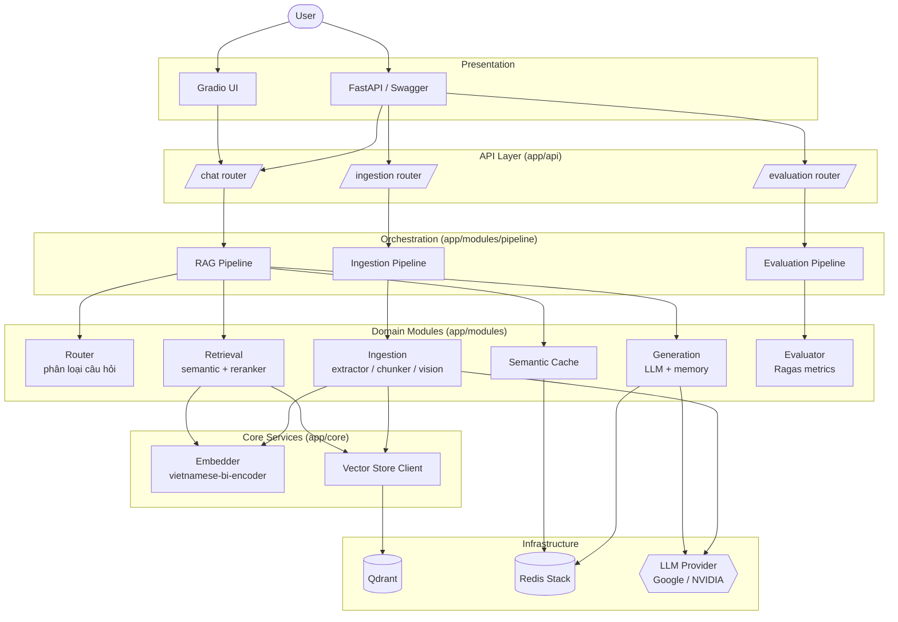

# Student Handbook RAG

Hệ thống Retrieval-Augmented Generation (RAG) cho sổ tay sinh viên (tiếng Việt), bao gồm pipeline ingestion tài liệu, semantic search trên Qdrant, semantic cache trên Redis, và sinh câu trả lời qua LLM (Google AI Studio hoặc NVIDIA API). Phục vụ qua FastAPI và giao diện Gradio.

---

## 1. Cài đặt môi trường và chạy

### Yêu cầu
- Python 3.10+
- Docker & Docker Compose (khuyến nghị)
- Git

### 1.1. Clone & tạo virtualenv

```bash
git clone <repo-url> student-handbook-rag
cd student-handbook-rag

python3.10 -m venv .venv
source .venv/bin/activate          # Linux / macOS
# .venv\Scripts\activate           # Windows

pip install -r requirements.txt
```

### 1.2. Tạo file `.env`

Tạo file `.env` ở thư mục gốc với các trường sau:

```env
# ===== LLM Provider =====
# "google" (Google AI Studio) hoặc "nvidia" (NVIDIA API)
LLM_PROVIDER=google

# ----- Google AI Studio -----
GOOGLE_AI_STUDIO_API_KEY=<your_google_ai_studio_key>
GOOGLE_LLM_MODEL=gemma-4-31b-it
GOOGLE_VISION_MODEL=gemma-4-31b-it

# ----- NVIDIA API (tuỳ chọn / fallback) -----
NVIDIA_API_KEY=<your_nvidia_api_key>
NVIDIA_INVOKE_URL=https://integrate.api.nvidia.com/v1/chat/completions
NVIDIA_VISION_MODEL=google/gemma-3-27b-it
LLM_URL=https://integrate.api.nvidia.com/v1
LLM_MODEL=google/gemma-3-27b-it

# ----- OpenAI (tuỳ chọn) -----
OPENAI_API_KEY=<your_openai_api_key>

# ===== Vector Store (Qdrant) =====
QDRANT_HOST=localhost
QDRANT_PORT=6333
QDRANT_COLLECTION_NAME=student_handbook_test

# ===== Embedding =====
EMBEDDING_MODEL_NAME=bkai-foundation-models/vietnamese-bi-encoder

# ===== Redis (semantic cache + memory) =====
REDIS_HOST=localhost
REDIS_PORT=6379
REDIS_URL=redis://localhost:6379
CACHE_THRESHOLD=0.78
CACHE_TTL=3600

# ===== Khác =====
DATABASE_URL=sqlite:///./sql_app.db
CHROMA_DB_PATH=./data/chroma
```

> Lưu ý: chỉ cần khai báo key của provider đang dùng (`LLM_PROVIDER`). Các key còn lại có thể để trống.

### 1.3. Chạy bằng Docker Compose (khuyến nghị)

Khởi động đồng thời Qdrant, Redis và API:

```bash
docker compose up -d --build
```

- API:        http://localhost:8000  (Swagger: `/docs`)
- Qdrant:     http://localhost:6333
- Redis Insight: http://localhost:8001

### 1.4. Chạy ở chế độ local (dev)

Bật Qdrant + Redis qua docker, còn API chạy trực tiếp:

```bash
docker compose up -d qdrant redis

# FastAPI
uvicorn app.main:app --reload --host 0.0.0.0 --port 8000

# Gradio UI (terminal khác)
python -m app.ui.gradio_app
```

### 1.5. Chạy test

```bash
pytest
```

---

## 2. Kiến trúc project



### Giải thích

- **Presentation**: người dùng tương tác qua Gradio UI hoặc gọi trực tiếp REST API (FastAPI/Swagger).
- **API Layer (`app/api`)**: ba router chính — `chat` (hỏi đáp), `ingestion` (nạp tài liệu), `evaluation` (đánh giá chất lượng).
- **Orchestration (`app/modules/pipeline`)**: ba pipeline điều phối luồng nghiệp vụ (RAG, Ingestion, Evaluation), được khởi tạo một lần khi app start (lifespan trong `app/main.py`) để pre-load model.
- **Domain Modules**:
  - *Router* phân loại câu hỏi để chọn nhánh xử lý phù hợp.
  - *Retrieval* tìm kiếm ngữ nghĩa trên Qdrant rồi rerank lại top-k.
  - *Generation* gọi LLM kèm ngữ cảnh + memory hội thoại.
  - *Semantic Cache* (Redis) trả về câu trả lời cũ nếu câu hỏi mới đủ gần (ngưỡng `CACHE_THRESHOLD`).
  - *Ingestion* trích xuất văn bản (PyMuPDF / Docling), phân tích bảng và hình ảnh (Vision LLM), chunk rồi embed.
  - *Evaluator* dùng Ragas đo các metric như faithfulness, context precision/recall.
- **Core Services (`app/core`)**: lớp dùng chung — `Embedder` (mô hình `bkai-foundation-models/vietnamese-bi-encoder`) và client `Vector Store`.
- **Infrastructure**: Qdrant lưu vector, Redis vừa làm semantic cache vừa lưu memory hội thoại, LLM provider có thể chuyển đổi giữa Google AI Studio và NVIDIA API qua biến `LLM_PROVIDER`.
